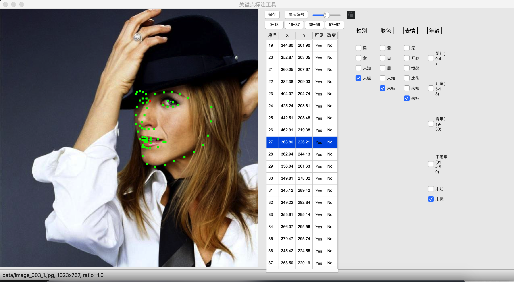

# 人脸标注工具

## 已有功能
按键失灵时可以多按几下，可能是pyqt的问题，使用久了就反应不过来。
- 可标注关键点、人脸属性（年龄、男女、人种）
- 可通过**鼠标**或**键盘**调节关键点
- 关键点可以标记是否可见
- 关键点的颜色分别是：选中->红色；不可见->蓝色；其他:绿色
- 可放大图片十倍，用鼠标滚轮操控
- 可以通过点击**关键点列表**第一列【序号】选择要用**键盘**控制的关键点，同时高亮
- 关键点坐标可以还原初始坐标，有两种方式：点击**关键点列表**第五列【改变】或按ESC键。
- **关键点列表**采用分页显示，如果某个点被选中，会自动跳到对应页面。
- 按【b】可跳转到上一条数据；按【n】可跳到下条数据
- 点击**显示编号**可显示点的编号
- 通过滑杆调节图片亮度
- 可通过旋转图片，以方便更准确的标注关键点
- 可通过**查看全貌**来看标注的脸整体现状